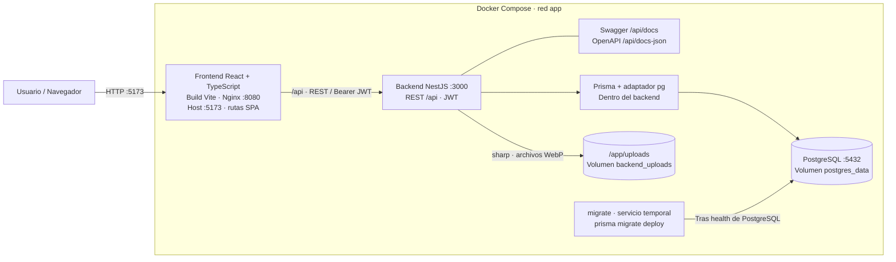

# Arquitectura implementada

Este documento describe el estado de entrega de CMPC Books. Los requisitos están
en [requirements.md](requirements.md), el recorrido por fases en
[implementation-plan.md](implementation-plan.md) y la ejecución en el
[README](../README.md). No propone cambios de contratos ni funcionalidades nuevas.

## Vista general



Prisma y Swagger pertenecen al proceso backend: no son contenedores adicionales.
Las imágenes se sirven a través de NestJS y del proxy `/api`; Nginx no expone
directamente el volumen. La API también se publica en el host para evaluación.
Puertos predeterminados: frontend 5173, backend 3000, PostgreSQL 5432, solo loopback.

En desarrollo local, Vite sustituye a Nginx y reenvía `/api` al backend local.
Ambos modos usan el mismo origen para el navegador: no se habilita CORS.
Un futuro despliegue con orígenes separados necesitará configurar una allowlist;
no es parte del despliegue actual.

## Monolito modular y responsabilidades

Frontend y backend son aplicaciones independientes, sin Nx/Turborepo. El alcance
no justifica microservicios, CQRS, brokers ni capas adicionales de infraestructura.

```text
Controller → Service → Prisma → PostgreSQL
```

Controllers resuelven HTTP, DTOs, parámetros, identidad JWT y códigos de respuesta.
Los servicios implementan reglas, verifican referencias y coordinan transacciones.
Solo servicios acceden a Prisma. PrismaModule exporta PrismaService y gestiona
conexión/desconexión. No hay Repository adicional: duplicaría una abstracción que
Prisma ya ofrece sin aportar un beneficio concreto en este challenge.

| Módulo | Responsabilidad |
| --- | --- |
| auth / users | Login, consulta de usuario, firma y validación JWT |
| books | CRUD, consultas, CSV y ciclo de vida de imágenes |
| authors / publishers / genres | Datos maestros de solo lectura |
| audit | Escritura de AuditLog en la transacción de negocio |
| prisma | Acceso PostgreSQL mediante Prisma y adaptador pg |
| common | Filtro de excepciones, DTOs compartidos e interceptor de tiempo |
| config | Validación de variables de entorno |

## Contratos HTTP y autenticación

El prefijo es `/api`; health está en `/api/health`. Swagger usa versión `1.0.0`
y está en `/api/docs`. El [README](../README.md#contratos-principales-de-api)
resume los endpoints; los DTOs y OpenAPI son la referencia detallada.

`POST /api/auth/login` valida el email y compara bcrypt con `User.passwordHash`.
Devuelve `{ accessToken, user: { id, email } }`, nunca el hash. La respuesta 401
es igual para usuario inexistente y contraseña incorrecta; se ejecuta bcrypt
también para usuarios inexistentes. No se registran contraseñas ni tokens.

JWT usa HS256, `sub`, `iat`, `exp`; el secreto y la duración se validan desde entorno.
Passport valida firma, algoritmo, expiración y existencia del usuario, y expone
solo id/email en `request.user`. Los controladores de libros y maestros usan guard.
Login, health, Swagger e imágenes de libros activos son públicos. No hay registro,
roles, refresh tokens ni endpoint de auditoría.

ValidationPipe aplica transformación, whitelist y rechazo de campos extra.
Los errores tienen `{ statusCode, message, error }` y conservan códigos HTTP
400/401/404/409/413/500; los errores inesperados no revelan internals de Prisma.
El interceptor agrega `X-Response-Time` hasta preparar la respuesta, sin envolver
JSON ni alterar streaming. No mide el tiempo completo de transferencia.

## Datos, consultas y transacciones

El [modelo relacional](data-model.md) documenta exactamente schema y migración.
PostgreSQL normaliza autores, editoriales y géneros. Los servicios no crean
maestros implícitamente. Prisma genera cliente CommonJS compatible con NestJS;
`prisma.config.ts` configura el CLI y `@prisma/adapter-pg` la conexión runtime.

Listado, filtros, búsqueda, orden y paginación se ejecutan en PostgreSQL.
`page` inicia en 1; `limit` predeterminado 20, máximo 100. Respuesta:
`{ data, meta: { page, limit, total, totalPages } }`. Precio es una cadena decimal
en respuesta; relaciones se proyectan a `{ id, name }`.

`search` usa coincidencia literal case-insensitive en título, autor y editorial.
Filtros: UUID de los tres maestros y disponibilidad. Multi-sort
`title:asc,price:desc` solo admite title, price, available, createdAt, updatedAt e id,
sin repeticiones y con asc/desc. Se agrega id como desempate si falta.
No se construyen consultas confiando en campos arbitrarios del cliente.

Las consultas normales exigen `deletedAt: null` en servicio. GET/PATCH/DELETE de
un libro eliminado retornan 404; DELETE nunca borra físicamente el registro.
Conteo y página comparten transacción **RepeatableRead**.

CREATE/UPDATE/DELETE y su AuditLog comparten transacción **Serializable**: si falla
auditoría, se revierte la mutación. Conflictos concurrentes retornan 409 para
reintento del cliente. AuditLog guarda usuario JWT, acción, entidad Book, id,
timestamp y nombres de campos afectados; no almacena valores sensibles ni archivos.
Upload modifica imageUrl y utiliza el mismo mecanismo de actualización auditada.

Auditoría de negocio y logging técnico son distintos. AuditLog es persistente y
transaccional; Nest registra actividad operativa y Nginx accesos HTTP. No existe
un sistema de logs estructurados, trazas o métricas centralizadas ni registro de
todas las lecturas como auditoría. El filtro global no registra excepciones crudas.

## CSV e imágenes

CSV reutiliza búsqueda/filtros, sin sort ni paginación del listado. Exporta por ID
en lotes de 500, con BOM UTF-8, CRLF y escapado de comillas; neutraliza texto que
podría interpretarse como fórmula. No carga todo el inventario en memoria.
Cada lote ve datos vigentes: no existe snapshot único durante la exportación.
Una falla de transferencia interrumpe la conexión.

Upload usa `POST /api/books/:id/image`, multipart campo `file`. Admite una imagen
fija JPEG/PNG/WebP hasta 5 MiB y 20 millones de píxeles. sharp valida el contenido
decodificado y el MIME, y recodifica WebP sin metadatos con nombre UUID.
La ruta pública `/api/uploads/:filename` solo sirve imágenes de libros activos,
sin listado de directorios ni rutas arbitrarias.

Se eligió almacenamiento local persistente por simplicidad del challenge.
Si falla la mutación se intenta retirar el archivo nuevo; al reemplazar se elimina
el anterior sin referencias. PostgreSQL y filesystem no tienen transacción común:
una caída o fallo de limpieza puede dejar archivos huérfanos. Soft delete conserva
archivos y bloquea su acceso público. No hay purga automática.

## Frontend

React + TypeScript + Vite con estructura por funcionalidad:

```text
src/
  app/           routing, layout, estilos
  features/auth/ login, sesión, protección de rutas
  features/books/ listado, formularios, detalle, eliminación, imágenes y API
  shared/api/    HTTP centralizado y descarga de archivos
  shared/components/
```

React hooks y un almacén pequeño con `useSyncExternalStore` cubren el estado
necesario. No se agregó Redux ni una librería UI grande. La capa HTTP centraliza
base URL, Bearer JWT y errores; no se duplican llamadas arbitrarias en componentes.

La sesión persiste accessToken e id/email en localStorage, sin contraseña. Es una
decisión pragmática: ante XSS el token es accesible. Si storage está bloqueado,
la sesión puede vivir en memoria. Se controla expiración en cliente para UX;
solo backend valida la firma. Un 401 limpia la sesión correspondiente y redirige
a login, sin cerrar una sesión nueva por una respuesta tardía del token anterior.

Rutas: `/login` y `/books`, `/books/new`, `/books/:id`, `/books/:id/edit` protegidas.
Listado implementa debounce de 400 ms, filtros, multi-sort y paginación en servidor;
la UI usa estados loading/error/empty. No sincroniza filtros con la URL.
Los formularios comparten validación; backend sigue siendo autoritativo. Crear
guarda primero el libro y sube la imagen después, comunicando éxito parcial y
permitiendo reintentar imagen sin duplicar el libro. Eliminar pide confirmación.

## Despliegue y configuración

Compose usa una red bridge compartida. PostgreSQL tiene volumen `postgres_data`;
backend monta `backend_uploads` en `/app/uploads`. Se conserva el nombre del
volumen PostgreSQL previo. No se importan uploads del host automáticamente.

Dockerfiles por etapas: build con Node 24, backend runtime con dependencias de
ejecución y frontend estático servido por Nginx. Ambos runtimes usan usuarios sin
root. El CLI Prisma y seed quedan en `migrate`, separado de la API. Su omisión
en runtime evita instalar el peer opcional del CLI; los peers necesarios de Nest
están declarados como dependencias del proyecto.

Los `.dockerignore` excluyen `.env` y artefactos locales. Compose inyecta secretos
al arrancar; no hay argumentos de build sensibles. El entrypoint crea la URL
interna con variables PostgreSQL y codificación de componentes; la URL del host
permanece disponible para desarrollo y tests. `.env.example` no contiene secretos.

Orden de arranque: PostgreSQL saludable → migraciones exitosas → backend saludable
→ frontend. Nginx resuelve rutas SPA, proxy `/api` y DNS de backend tras recreación.
El seed es manual e idempotente, permitido solo con `NODE_ENV=development`.

## Verificación y límites

Jest prueba servicios, HTTP, JWT, validaciones, soft delete, consultas, CSV,
imágenes y rollback. Hay integración PostgreSQL con fixtures transaccionales.
Vitest/RTL prueba sesión, cliente HTTP, rutas y flujos de libros. La cobertura
actual y comandos reproducibles están en el [README](../README.md#tests-y-cobertura).
No hay lint configurado ni suite automatizada de navegador real.

Evoluciones documentadas, no implementadas: cookies HttpOnly con protección CSRF,
S3/Azure Blob y purga de archivos, snapshot consistente de CSV, observabilidad,
rate limiting, backups automatizados, CI/CD, TLS y despliegue cloud. Los índices
actuales no garantizan búsqueda substring eficiente a gran escala; una evolución
requerirá mediciones y posibles índices especializados. Se conservan los límites
del challenge sin anticipar microservicios, Kubernetes, roles o CRUD de maestros.
