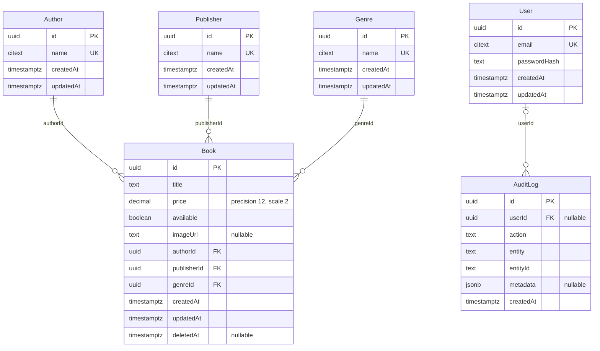

# Modelo relacional

Fuentes: [schema.prisma](../backend/prisma/schema.prisma) y
[migración inicial](../backend/prisma/migrations/20260909000000_init/migration.sql).
El diagrama muestra columnas persistidas; las propiedades de navegación Prisma
(`books`, `auditLogs`, `author`, `publisher`, `genre`, `user`) se representan como
relaciones, no como columnas adicionales.

## Tipos y nulabilidad

Todos los IDs son UUID generados por PostgreSQL con `gen_random_uuid()`.
En Prisma corresponden a `String @db.Uuid`; los timestamps son `DateTime` con
`@db.Timestamptz(3)`. `createdAt` tiene `now()` y `updatedAt` lo mantiene Prisma
con `@updatedAt` (no un trigger de PostgreSQL). AuditLog no tiene `updatedAt`.

Solo son nullable: `Book.imageUrl`, `Book.deletedAt`, `AuditLog.userId` y
`AuditLog.metadata`. El resto de columnas es obligatorio. `Book.available` tiene
default true en base; el DTO de creación exige boolean explícito. `price` es
`Decimal(12,2)` y no incluye moneda. `entityId` es texto, **no una FK a Book**;
permite identificar entidades sin acoplar la tabla de auditoría a una sola tabla.
`action` y `entity` son strings, no enums PostgreSQL. `metadata` es JSONB.

## Relaciones e integridad

- Cada Book pertenece a exactamente un Author, Publisher y Genre. Cada maestro
  puede tener cero o muchos libros. Las tres FK usan `ON DELETE RESTRICT` y
  `ON UPDATE CASCADE`; no se borran maestros referenciados.
- Cada User puede tener cero o muchos AuditLog. Un AuditLog puede no tener User:
  su FK usa `ON DELETE SET NULL` y `ON UPDATE CASCADE`, conservando el historial.
  La aplicación actual escribe el usuario autenticado en mutaciones de libros.
- Los libros usan `deletedAt` para soft delete; este campo no elimina filas ni
  relaciones físicamente. Los servicios excluyen los eliminados de consultas normales.

## Unicidad, restricciones e índices

La migración instala `citext`. Email de usuario y nombres de maestros tienen
índices únicos case-insensitive, que evitan duplicados por diferencias de
mayúsculas. No se elimina la distinción de acentos ni hay comparación difusa.

CHECK adicionales, presentes en SQL aunque Prisma no los represente en el schema:

- Precio de Book no negativo.
- Email no vacío, sin espacios internos ni exteriores.
- Nombres no vacíos, sin espacios exteriores ni secuencias de espacios sin normalizar.

Los seis índices no únicos de Book son sobre `title`, `authorId`, `publisherId`,
`genreId`, `available` y `deletedAt`. Los índices únicos cubren `User.email`,
`Author.name`, `Publisher.name` y `Genre.name`; cada PK también tiene su índice.
No hay índices compuestos, de texto completo o adicionales en AuditLog.

## Migraciones, seed y atomicidad

Usar migraciones versionadas; no alterar manualmente el schema ni usar `db push`.
Los CHECK y citext deben conservarse al generar futuras migraciones. La generación
del cliente no sustituye la aplicación de migraciones.

El seed hace upserts transaccionales para User y maestros, conserva sus datos
existentes y no crea Book ni AuditLog. Requiere configuración explícita de
desarrollo y guarda bcrypt, nunca contraseña en claro.

En la aplicación, cada mutación de Book y su AuditLog comparten transacción
Serializable. La consistencia de archivos no pertenece a esa transacción SQL;
sus compensaciones y límites están en [architecture.md](architecture.md).
